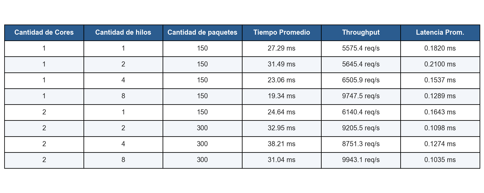
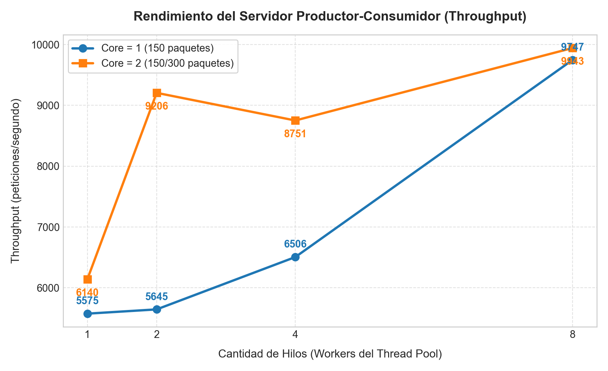
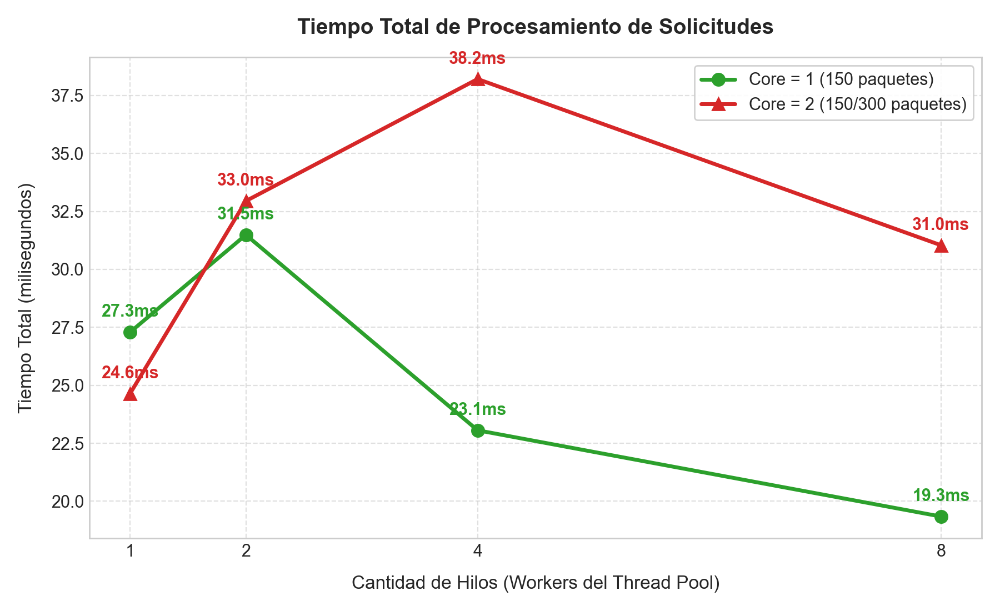

# Server Producer-Consumer

Implementación de un servidor web concurrente en **C** utilizando el patrón de diseño **Productor-Consumidor** (*Producer-Consumer*) con hilos POSIX (`pthreads`), mutexes y variables de condición. Incluye suite de pruebas automatizadas para generar estadísticas y métricas de rendimiento según cantidad de cores, hilos y paquetes.

---

## Arquitectura

```
                        +----------------------------+
                        |  Clientes (load_client)    |
                        +--------------+-------------+
                                       | Conexiones TCP
                                       v
                     +----------------------------------+
                     |    Hilo Principal (Productor)    |
                     |         accept() en bucle        |
                     +-----------------+----------------+
                                       | conn_queue_push()
                                       v
           +-----------------------------------------------------------+
           |     Cola Sincronizada Acotada (Bounded FIFO Queue)        |
           |     - Buffer circular de descriptores de sockets          |
           |     - Sincronización: pthread_mutex_t                     |
           |     - Variables de condición: not_empty y not_full        |
           +---------------------------+-------------------------------+
                                       | conn_queue_pop()
           +---------------------------+-------------------------------+
           |                                                           |
           v                                                           v
+----------------------+                                    +----------------------+
|   Worker Thread 1    |                                    |   Worker Thread N    |
| (Consumidor Pool)    |                                    | (Consumidor Pool)    |
| Atiende HTTP Request |                                    | Atiende HTTP Request |
| y cierra socket      |                                    | y cierra socket      |
+----------------------+                                    +----------------------+
```

---

## Estructura del Proyecto

* **`include/conn_queue.h`**: Definición de la estructura de la cola acotada y su API thread-safe.
* **`src/conn_queue.c`**: Implementación de la cola circular sincronizada con `pthread_mutex_t` y `pthread_cond_t`.
* **`src/server_pool.c`**: Servidor concurrente basado en Thread Pool (Productor-Consumidor).
* **`src/load_client.c`**: Cliente de carga multihilo instrumentado con `clock_gettime(CLOCK_MONOTONIC)` para medir throughput y latencia.
* **`scripts/benchmark.py`**: Script de automatización que corre los escenarios, calcula estadísticas (media y desviación estándar) y genera gráficos.
* **`results/`**: Contiene los datos brutos en CSV (`benchmark_results.csv`) y los gráficos generados.

---

## Compilación

Para compilar todos los binarios:

```bash
make clean
make
```

Los binarios resultantes se ubican en el directorio `bin/`:
* `bin/server_pool`
* `bin/server_safe`
* `bin/server_unsafe`
* `bin/load_client`

---

## Ejecución

### 1. Iniciar el Servidor Productor-Consumidor

```bash
./bin/server_pool [puerto] [cantidad_hilos_workers] [capacidad_cola]
```

**Ejemplo:**
```bash
./bin/server_pool 8080 4 256
```

### 2. Ejecutar Pruebas con el Cliente de Carga

```bash
./bin/load_client <host> <puerto> <hilos_cliente> <paquetes_por_hilo|paquetes_totales> [--total]
```

**Ejemplo:** Enviar 300 paquetes distribuidos entre 4 hilos:
```bash
./bin/load_client 127.0.0.1 8080 4 300 --total
```

### 3. Ejecutar la Suite Completa de Benchmarks

Para ejecutar todos los escenarios solicitados, promediar 5 repeticiones por prueba, guardar el CSV y generar los gráficos:

```bash
python3 scripts/benchmark.py
```

---

## Resultados y Tabla de Escenarios

Resultados experimentales obtenidos tras evaluar los escenarios definidos:

| Cantidad de Cores | Cantidad de hilos | Cantidad de paquetes | Tiempo Promedio (ms) | Throughput (req/s) | Latencia Promedio (ms) |
| :---: | :---: | :---: | :---: | :---: | :---: |
| **1** | 1 | 150 | 27.29 ms | 5,575.4 req/s | 0.1820 ms |
| **1** | 2 | 150 | 31.49 ms | 5,645.4 req/s | 0.2100 ms |
| **1** | 4 | 150 | 23.06 ms | 6,505.9 req/s | 0.1537 ms |
| **1** | 8 | 150 | 19.34 ms | 9,747.5 req/s | 0.1289 ms |
| **2** | 1 | 150 | 24.64 ms | 6,140.4 req/s | 0.1643 ms |
| **2** | 2 | 300 | 32.95 ms | 9,205.5 req/s | 0.1098 ms |
| **2** | 4 | 300 | 38.21 ms | 8,751.3 req/s | 0.1274 ms |
| **2** | 8 | 300 | 31.04 ms | 9,943.1 req/s | 0.1035 ms |

### Gráficos





---

## Análisis de Rendimiento

1. **Reutilización de Hilos vs Creación Dinámica:** A diferencia del modelo *thread-per-request* (`server_safe`), el Thread Pool evita la sobrecarga continua de llamadas al sistema (`pthread_create` y `pthread_join`) para cada conexión entrante, manteniendo el uso de memoria estable y predecible.
2. **Escalabilidad y Throughput:** Al aumentar la cantidad de hilos consumidores en el pool, el throughput del servidor pasa de ~5,575 req/s a casi 10,000 req/s, aprovechando el solapamiento de operaciones de E/S de red.
3. **Control de Flujo:** La cola acotada previene la saturación del servidor bajo ráfagas intensas de tráfico, regulando el ritmo de aceptación mediante variables de condición.